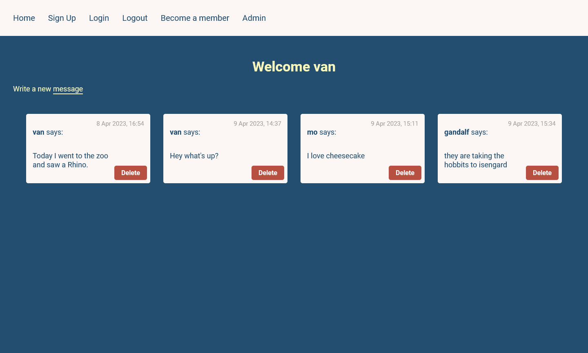
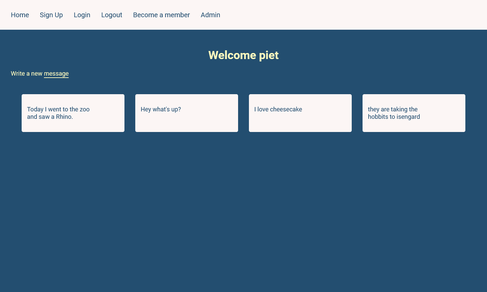
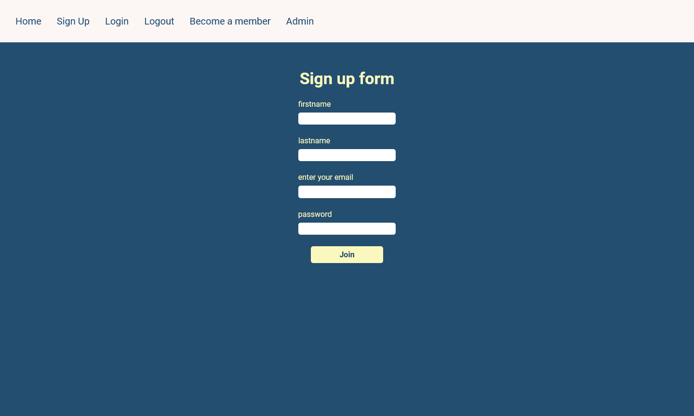

# The Odin project - Members only project

This is a project from the [Odin project](https://www.theodinproject.com/paths).

I really enjoyed working on this project, although it took me a while to understand how authentication and sessions work.

## Overview

The objective of this project is to practice authentication aswell as database skills in express.
Users can:
- Sign up
- Login / Logout
- Post messages (only members can view the author and date of the message)
- Become Members
- Become an admin

### Technologies used:

- NodeJS with Express
- EJS
- MongoDB using mongoose
- PassportJS for authentication
- bcryptjs

### screenshots

### helpful links

[NodeJS and passport authentication article](https://medium.com/@prashantramnyc/node-js-with-passport-authentication-simplified-76ca65ee91e5)

